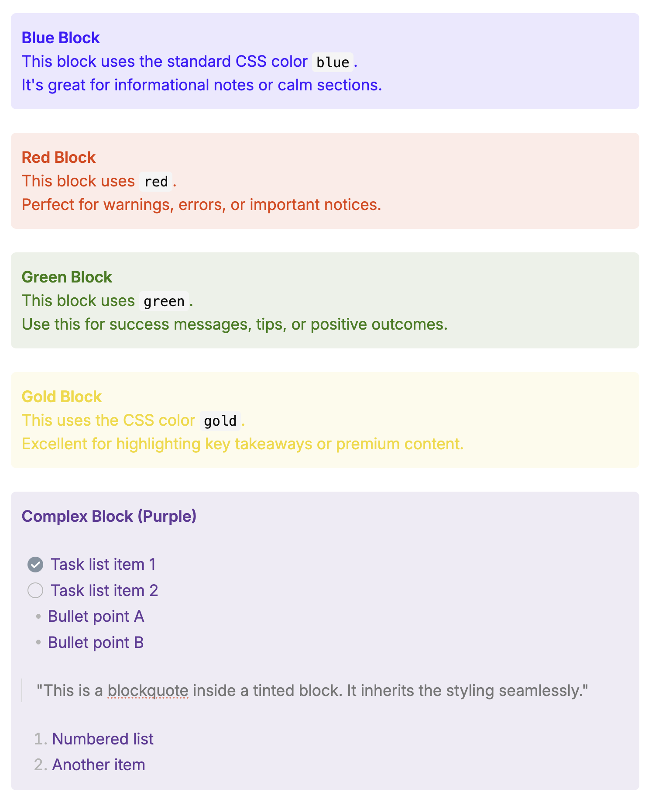

# Tinted Blocks 🎨

> Add a splash of color to your Obsidian notes. Highlight blocks of text elegantly, just like in Notion or Craft, but with more power.



**Tinted Blocks** allows you to wrap any content—paragraphs, lists, blockquotes—in a beautiful, colored container. It supports both **Live Preview** and **Reading View**, ensuring your notes look stunning in any mode.

## ✨ Features

- **Dynamic Block Coloring**: Use any valid CSS color name (`blue`, `red`, `gold`) or hex code (`#ff00aa`).
- **Inline Highlighting**: Highlight text with color markers (Red, Green, Blue, Yellow, Cyan, Magenta).
- **Table Cell Tinting**: Add background colors to individual table cells using simple markers.
- **Clean Reading View**: All markers are completely removed in Reading View for a polished look.
- **Rich Content Support**: Works perfectly with **bullet lists**, **numbered lists**, and **blockquotes** inside the colored block.
- **Native Integration**: Use the **Command Palette**, **Right-Click Menu**, or customize **Hotkeys**.

---

## 🚀 How to Use

### 1. Block Tinting

Wrap entire paragraphs or sections in a colored block.

#### Syntax
Type the start marker followed immediately by a color, write your content, and close with the end marker.

```markdown
/--blue
This is a blue block.
It supports **Markdown** formatting.
--/
```

**Strict Syntax Rules:**
- **No Space**: You must type the color immediately after the marker (e.g., `/--red`, NOT `/-- red`).
- **Valid CSS Colors**: Use standard CSS colors or hex codes.
- **Fallback**: If you omit the color (`/--`) or use an invalid one, the block will use your **Default Block Color** setting.

#### The "Mouse" Way
1. Select text.
2. Right-click and choose **Tint block**.
3. Or assign a custom hotkey in **Settings -> Hotkeys**. For example, you can use `Cmd/Ctrl + Shift + '` to match the behavior in Craft.

### 2. Inline Highlighting

Highlight specific parts of a line, like using a highlighter pen.

#### Syntax
Surround your text with double colons `::`. You can specify a color code (`r`, `g`, `b`, `y`, `c`, `m`) followed by a colon.

- **Default (Yellow)**: `::text::` → 
- **Red**: `::r:text::` → 
- **Green**: `::g:text::` → 
- **Blue**: `::b:text::` → 
- **Yellow**: `::y:text::` → 
- **Cyan**: `::c:text::` → 
- **Magenta**: `::m:text::` → 

#### The "Mouse" Way
1. Select text.
2. Right-click and choose **Highlight text**. (Defaults to yellow).
3. Or assign a custom hotkey in **Settings -> Hotkeys**. For example, you can use `Cmd/Ctrl + Shift + B` to match the behavior in Craft.

### 3. Table Cell Tinting (Alpha)

Add background colors to specific cells in a table.

#### Syntax
Add a color marker at the beginning of the cell content.

```markdown
| Header 1 | Header 2 |
| :r: Red Cell | :g: Green Cell |
| Normal Cell | :b: Blue Cell |
```

Supported markers: `:r:` (Red), `:g:` (Green), `:b:` (Blue), `:y:` (Yellow), `:c:` (Cyan), `:m:` (Magenta), `:a:` (Gray/Default).

---

## ⚙️ Customization

Go to **Settings** -> **Tinted Blocks** to configure:
- **Block Start Marker**: Default is `/--`.
- **Block End Marker**: Default is `--/`.
- **Default Block Color**: Choose the color used when no specific color is provided (defaults to `#555555`).
- **Inline Marker**: Default is `::`.

---

## 🛠️ Development

This plugin was built with TypeScript and uses the Obsidian API.

### Prerequisite
- Node.js (v18+)
- npm

### Setup
1. Clone the repository.
2. Run `npm install` to install dependencies.
3. Run `npm run dev` to start compilation in watch mode.

### Building
Run `npm run build` to create a production build (`main.js`, `styles.css`, `manifest.json`).

---

<p align="center">
  Made with ❤️ for the Obsidian Community.
</p>
